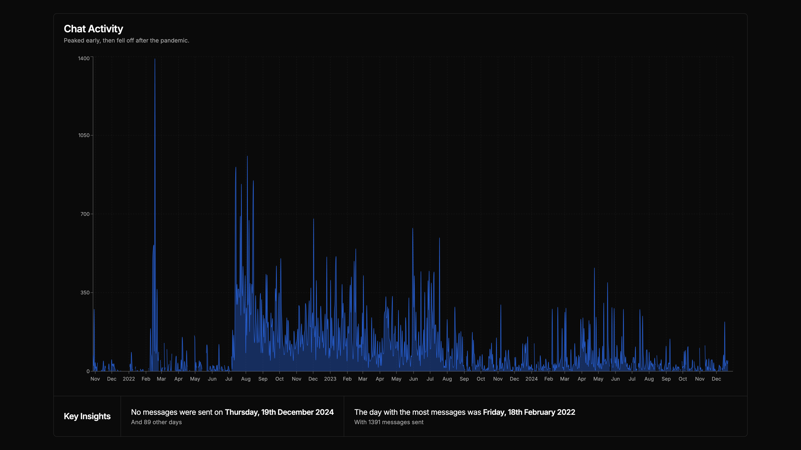
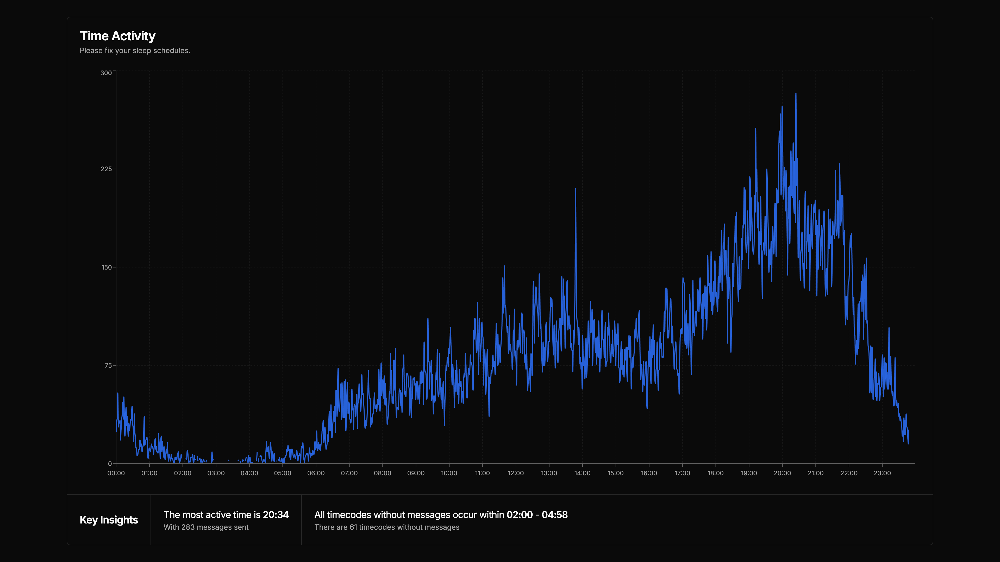
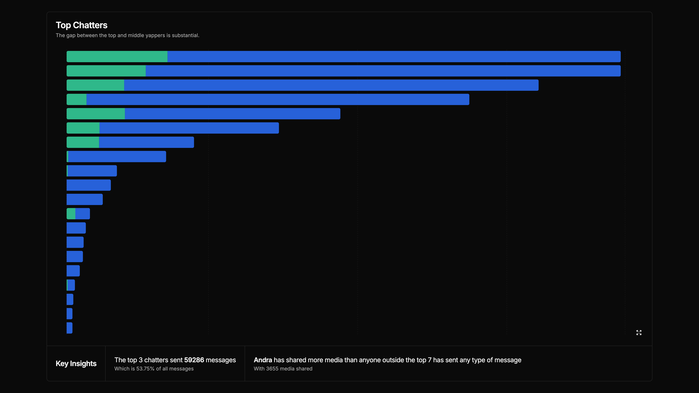
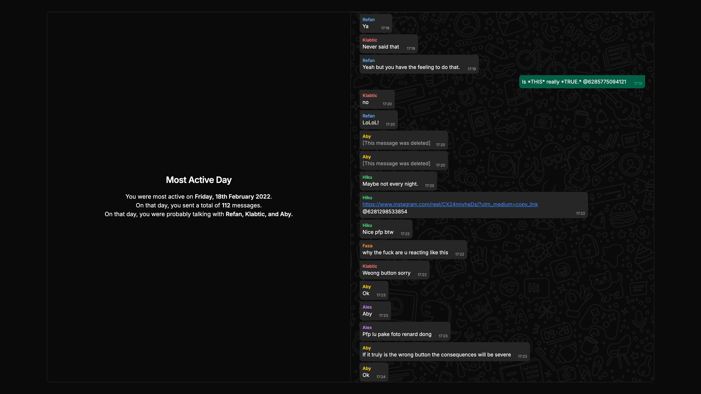

Okay, so right before new year's eve, I decided to make a recap of my group chat's activity.
I called it "Wrapped" because it's like Spotify Wrapped, but for our group chat.

I made a website for it, and it's pretty cool. It has a bunch of stats, like the most active members, the most used emojis, and the most common words.
In this blog post, I'll go over some of the highlights.
Also, in the end I'll share the code for the parsing, in case you want to make your own.

# Chat Activity

This is a graph of the chat activity over the years. As you can see that it's been pretty consistent, with a few spikes here and there.
The graph shows a trend of decreasing activity, which is expected as people get busier with their lives.

One thing I had to do for this part was fill the dates with no messages with "empty" data. This was so that the graph would show the gaps in the data.

# Time Activity

This is a graph of the chat activity over the hours of the day. It shows that most of the activity happens in the evening, around 16:00-20:00.
This is when most people are free from work or school, so it makes sense.

There's also a weird drop at around 15:00-17:00, which I'm not sure why it happens.
I would guess it's from people being busy with commuting from school, but I'm not sure.

I really wish this graph was better. The data is really good data but the way I visualized it wasn't ideal.
I wanted to use something like a polar graph to show the time of day so that it would loop around, but it never worked out using the libraries I found.

# Top Chatters

This is a graph of the top chatters in the group chat.
The blue bars show the number of messages sent by each person, and the green bars show the amount of media shared.
I hid the names for privacy reasons (totally not because I couldn't screenshot them), but you can roughly guess how many messages the top chatter sent, at around 18000 messages.

As you can see, a lot of media was shared in the chat. You might guess it's photos or videos, but it's actually mostly WhatsApp stickers.
I didn't count the number of stickers shared, but I would guess it's more than 50% of the media shared.
This is due to the fact that we used to spam stickers a lot, and they're counted as media.

# Personal Highlight

There's really nothing special in the "personal" part of the website. It's just the same data as the global data but filtered for each person.

Except for this one. I'm really proud of this one. I highlighted everyone's most active day.
I think it's really cool to see when each person was most active, who they were talking with, and what they were talking about.
It's even complete with WhatsApp-like bubbles and everything.

One thing I'd like to do next time I do this is to display images. This requires downloading every single image sent in the chat, which is a lot of work.
I might do it in the future, but for now, I'm happy with how it turned out.

# Code

I used Python to parse the chat data. I'm not really gonna go into detail about it, but you'll see the code on my GitHub.
You can find it [here](https://github.com/velolib/whrapped)

# Final Thoughts

Overall, I'm really happy with how the website turned out. It was a lot of work, but it was worth it.
I hope I get to do this again next year, maybe with more insights and better visualizations.
That's it for now. Thanks for reading.
