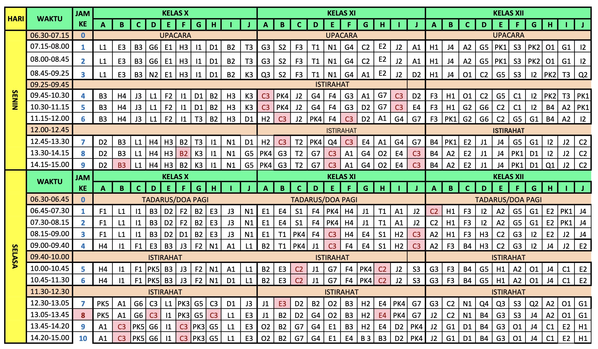

So, I compiled my school schedule into a Google Sheets document. It has all my classes, their times, and the teachers. This is for every class in my grade.

Sometimes the schedule gets updated by the school, so I have to update it in the document. It's a bit of a hassle, but it's worth it to have all the information in one place. They also give it
in a PDF, so I have to manually type it in. It's easier with vscode's multi-cursor feature, but I wish I could just copy-paste it. The image above is a screenshot of the document they give.

See it at [Google Sheets](https://docs.google.com/spreadsheets/d/1ZUvf3bl6fCPauUt-HUzZ16VEG7wWCiuffc4Grwypm_o/edit?usp=sharing)
